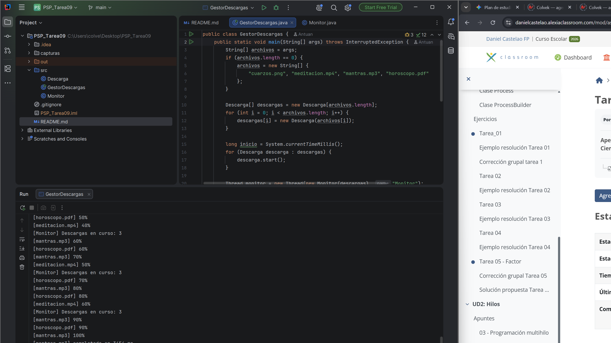
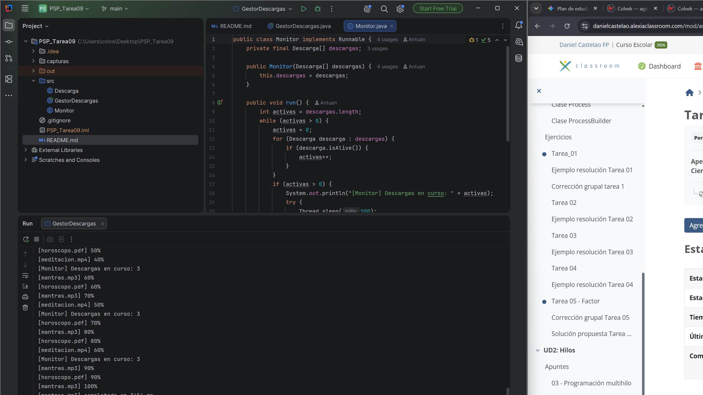

Tarea 09 - PSP

Antuan Herrera Icaza - DAM2

Hice los niveles 1 y 2. Cada archivo va en su hilo. Arranco todos antes de
esperar a que acaben, y el monitor dice cuántos siguen cada medio segundo.

Para ejecutarlo abro GestorDescargas en IntelliJ. Sin argumentos usa los
cuatro archivos del enunciado. Desde una terminal:

javac -d out src/*.java

java -cp out GestorDescargas

También se pueden pasar otros nombres: java -cp out GestorDescargas apuntes.pdf video.mp4

Una salida que me dio, quitando los porcentajes del medio:

[Monitor] Descargas en curso: 4  
...  
[Monitor] No queda ninguna descarga en curso  
Todas las descargas han terminado.  
Tiempo real: 3568 ms  
Si se hubieran descargado una detras de otra: 8538 ms

Pruebas que hice

| Ejecución | Descarga más lenta | Tiempo real (ms) | Suma (ms) |
|---|---|---:|---:|
| 1 | mantras.mp3 | 3568 | 8538 |
| 2 | meditacion.mp4 | 3576 | 11206 |
| 3 | mantras.mp3 | 4857 | 11172 |

El tiempo real es menor que la suma porque los archivos van a la vez. Se
espera al más lento.

Probé start() y join() en el mismo bucle y me dio 13662 ms, porque hacía una
descarga detrás de otra.

Capturas:

